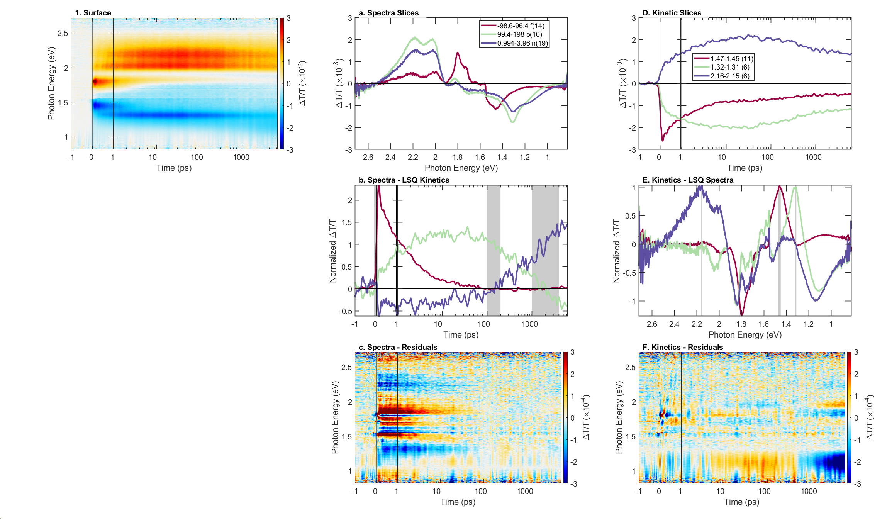
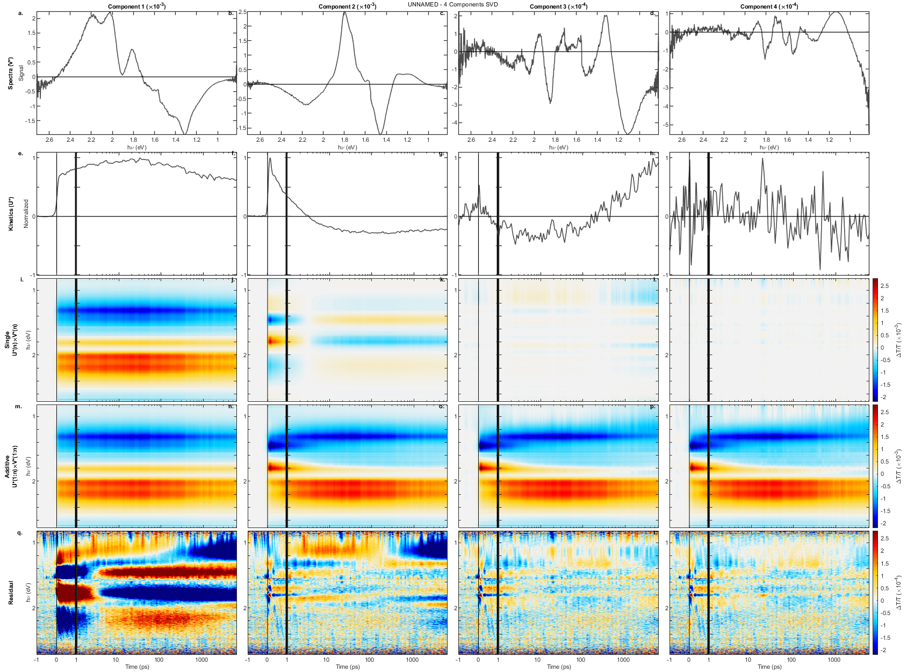
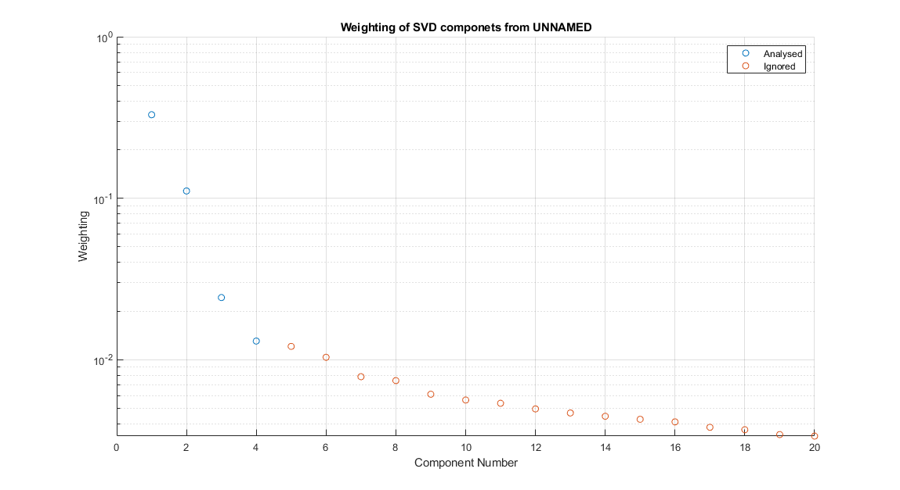

# Quick Data Visualization

## Introduction
Welcome to a bunch of scripts to help analysis your 2D data. The set of scripts here are designed to help you understand your 2D data from a purely data driven stand-point. It will let you slice, svd, and global fit a data set.

There are two main scripts to run
1. quick_dataVisulisation

2. quick_rotate_LSQ

3. quick_explore_GF

   

The MATLAB command window will have important details, please read.

## Overview of the data analysis types

A brief description of the functions is below, please read the individual sections for more details on each, they are located after the 'Running the scripts' section

### plot_surface

Will represent the data surface.

### plot_slices 

This will take simple kinetic and spectra of the dataset, it will intergrade between the regions entered. The slices are defined in the `%% Plotting` section of the code.

### plot_slices _LSQ  

Will use the same spectra and kinetics defined above but tread them as the known components and do LSQ to determine the other axis. i.e the user defined spectra will give kinetics

### do_SVD  

Runs SVD (singular value decomposition) on the data and plots the results in a manner to try and identify the number of components/

### do_global_fit  

Fits the data to a number of exponential decay components. Presents a summary of the various fits attempted.

### quick_explore_GF 

A **separate script** to explore and plot the results from the global fitting

## Running the scripts

Run the script called "quick_dataVisulisation", the majority of lines in this code are inputs into the various analysis types mentioned above. 

```matlab
quick_dataVisulisation
```

## plot_surface

The most rudimentary presentation of the data. The color scale is white/grey at zero, with positive values being red and negative being blue. 

### Goal

Identify spectra and kinetic regions that change over time.

### Description of  output

A single figure comprised of 4 panels

<ol type="a">
  <li>The original data, without any cropping. Use this to make sure the cropping is correct</li>
  <li>Cropped data at with the z-limits you have chosen.</li>
  <li>Cropped data with z-limit ten times tighter then chosen</li>
  <li>Cropped data with z-limits ten time looser then chosen</li>
</ol>


### Example description of analysis

#### Cropping

* The data blue region of the data has been cropped because the sample absorbs the probe here.
* Red end cropped based on WLG stability

#### Regions

* There are three distant time regions
  * -1 ns to 0
  * 3 ns to 10 ns
  * 1us +
* The spectral features that decay on similar time scales are
  * PIA at ~1 eV has a short lifetime
  * PIA at 1.3 eV is narrow and live to 1us +
  * Broad PIA centered about 1.9 eV has lifetime ~10ns


## plot_slices 

Taking slices along the two axis of your data is the most rudimentary and important step of data analysis. 


## plot_slices _LSQ  



## do_SVD  





## do_global_fit  


## quick_explore_GF 


